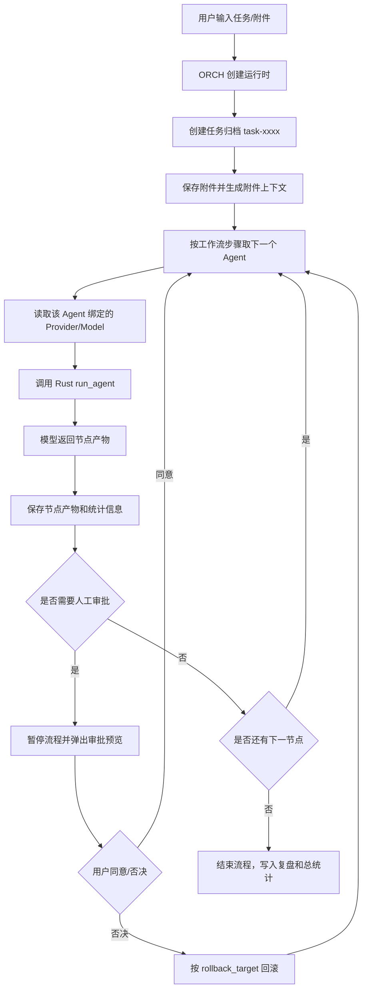

# ORX 客户端核心工作原理

这份文档说明 ORX 当前客户端的核心运行逻辑：调度者如何分配任务，Agent 之间如何“对话”，巡检推进机制如何工作，以及审批、打回、产物和上下文是如何串起来的。

## 1. 核心角色

ORX 里有两类“管理者”概念，需要分清：

- **ORCH**：程序调度器。它不是一个模型 Agent，而是客户端里的流程控制逻辑，负责读取工作流配置、按顺序调用 Agent、保存产物、处理审批、打回重做、统计耗时和 token。
- **PM Agent**：流程管理 Agent。它是一个真实模型 Agent，负责 Intake、复盘总结、流程治理建议等内容产出。

其他 Agent：

- **PD Agent**：产品 Agent，负责需求澄清、场景预演、边界探测、验收口径。
- **DEV Agent**：开发 Agent，负责实现拆解、代码/文件产物、测试驱动实现任务。
- **ARCH Agent**：架构师 Agent，负责代码 Review、红蓝质询、架构风险、非功能边界。
- **QA Agent**：测试 Agent，负责测试计划、集成测试、端到端测试、回归路径和执行证据。

## 2. 总体链路

用户在底部输入任务后，ORCH 会启动一个工作流运行时。运行时主要包含：

- 用户任务文本。
- 当前选中的工作流步骤列表。
- 下一个要执行的步骤下标。
- `upstream` 上游上下文。
- 任务归档目录。
- 节点累计耗时和 token。
- DEV 文件产物失败重试计数。

简化流程如下：



## 3. 工作流配置如何决定调度

工作流本质是一组有序节点，每个节点包含：

- `stage`：阶段名，例如 `ScenarioRehearsal`、`TaskSplit`、`CodeReview`。
- `owner`：负责人，例如 `PD Agent`、`DEV Agent`。
- `instruction`：该节点应完成的工作说明。
- `enabled`：是否启用。
- `approval`：交付确认方式，支持 `none`、`user`、`auto`。
- `rollback_target`：失败或否决后打回到哪个阶段。

默认完整流程是：

```text
PM / Intake
PD / ScenarioRehearsal
PD / BoundaryProbe
DEV / TaskSplit
ARCH / CodeReview
QA / TestPlan
PM / Retrospective
```

其中默认的人工审批点是：

- `PD Agent / ScenarioRehearsal`：产品文档产出后需要用户确认。
- `ARCH Agent / CodeReview`：架构师 Review 后需要用户确认。

如果用户选择 Bug 修复流程、仅测试流程，或者自己编辑工作流，ORCH 会按当前启用的节点重新调度。

### 3.1 动态工作流路由

任务启动时，ORCH 会先根据用户任务文本做一次轻量分类，再从当前可用工作流中选择本轮最合适的模板：

- 缺陷、报错、修复、异常、回归等任务优先走 `Bug 修复流程`。
- 只要求补测试、测试计划、集成测试或端到端测试时优先走 `仅测试流程`。
- 新增、创建、实现、页面、表单、组件等任务优先保留 `完整需求开发流程`。
- 如果任务类型不明确，ORCH 会沿用用户当前选择的工作流，避免过度自动切换。

动态路由只决定本轮使用哪组步骤，不会删除或改写用户保存的工作流配置。界面会在启动日志中显示路由选择、置信度和原因。

## 4. Agent 之间怎么“对话”

当前 ORX 不是让 Agent 之间直接互相发消息，也不是开一个多 Agent 群聊。真实机制是：

1. ORCH 调用当前 Agent。
2. 当前 Agent 返回文本产物。
3. ORCH 把这个产物追加到 `upstream` 上游上下文。
4. 下一个 Agent 调用时，ORCH 把完整 `upstream` 一起发给它。

`upstream` 的格式类似：

```text
用户任务：做一个 index.html 表单页面

指定上下文文件：
- D:\Project\src\App.tsx

对话附件：
- screen.png [image] 2113 bytes -> C:\Users\...\ORX\tasks\task-xxxx\attachments\screen.png

[PM Agent / Intake]
PM 的 Intake 产物...

[PD Agent / ScenarioRehearsal]
PD 的 PRD/场景预演产物...

[DEV Agent / TaskSplit]
DEV 的实现产物...
```

所以“Agent 相互对话”的本质是：**上一个 Agent 的产物成为下一个 Agent 的上下文输入**。所有交接都经过 ORCH，Agent 不直接点对点通信。

## 5. ORCH 下发给 Agent 的 Prompt 结构

每次调用模型时，Rust 后端会构造统一 Prompt，核心内容包括：

- 你是谁：`你是 PD Agent`、`你是 DEV Agent` 等。
- 角色说明：不同 Agent 有不同职责边界。
- ORCH 下发的用户任务。
- 当前流程节点。
- 上游产物/上下文。
- 特殊规则。

例如 DEV 会额外收到文件产物规则：

```text
如果当前任务或上游附件内容要求生成代码文件、HTML、CSS、JS、脚本或配置，
必须直接输出可落盘的完整文件内容。
需要在 Markdown 代码块第一行写明文件名，例如 <!-- FILE: index.html -->。
没有实际非空代码块会被视为 DEV 节点失败并打回。
```

PM 会额外收到总结归纳规则：

```text
每个任务流程处理完后，必须输出总结归纳，覆盖本轮结论、节点交接、失败/打回/阻塞点、关键证据和下一轮改进项。
```

## 6. 模型调用链路

前端不直接请求模型 API，而是调用 Tauri command：

```text
前端 App.tsx
  -> invoke("run_agent")
  -> Rust provider_config.rs
  -> reqwest HTTP Client
  -> OpenAI-compatible /responses endpoint
```

Provider 配置包括：

- Provider 名称。
- Base URL。
- 模型名。
- API Key 引用名。
- 是否启用代理。
- 代理地址。

Base URL 只配置到 `/v1`，程序会自动拼接：

```text
{base_url}/responses
```

API Key 读取顺序：

1. 先读同名环境变量。
2. 读不到再读 `%APPDATA%\ORX\secrets.json`。

## 7. 附件和图片如何进入 Agent

附件会先被保存到任务归档目录：

```text
%APPDATA%\ORX\tasks\task-xxxx\attachments\
```

文本附件会提取预览，加入 `upstream`。图片附件会保留路径和元数据，模型调用前 Rust 会扫描 `upstream` 中的图片路径，然后把图片读成 data URL，作为 Responses API 的 `input_image` 传给支持视觉能力的模型。

也就是说，图片不是只把路径告诉模型，而是在支持的情况下会把真实图片内容作为模型输入发送。

## 8. 巡检机制是什么

当前 ORX 的“巡检”不是固定每 5 分钟轮询，也不是后台定时任务，而是**实时巡检 / 节点完成即推进**。

它的工作方式：

1. ORCH 下发当前节点给 Agent。
2. 等待 `run_agent` 返回。
3. 返回成功后立即检查节点状态、产物、token、耗时。
4. 如果不需要审批，立即推进下一节点。
5. 如果需要审批，暂停流程并等待用户。
6. 如果失败，立即停止流程并输出诊断。

因此巡检的本质是一个同步推进循环：

```text
for step in enabledSteps:
  调用 Agent
  检查结果
  保存产物
  判断产物闸门
  判断审批闸门
  继续或暂停或失败
```

界面上的 `ORCH 实时巡检中`、`PD Agent 处理中`、`等待审批`，都是这个运行时状态的展示。

## 9. 审批和打回机制

当节点配置为 `approval: "user"` 时：

1. Agent 完成后，ORCH 保存产物。
2. ORCH 暂停工作流。
3. 中间弹出审批预览。
4. 用户可以填写审批意见。
5. 用户点击同意或回复“同意/批准/通过”，流程继续下一节点。
6. 用户点击否决或回复“否决/打回/不通过”，流程回滚到 `rollback_target`。

否决时，ORCH 会把否决意见写入新的 `upstream`：

```text
[ORCH / rejection]
用户否决 ARCH Agent / CodeReview 产物。
回滚目标：DEV Agent / TaskSplit
否决意见：字段不完整，少了国家字段。
```

被打回的 Agent 会看到这个否决意见，从而按意见重做。

## 10. DEV 产物闸门

为了避免“只输出计划，不生成文件”的问题，ORX 对代码类任务加了 DEV 产物闸门。

触发条件：

- 用户任务或上游上下文里出现 HTML、页面、表单、文件、代码、脚本、CSS、JS、实现、生成等关键词。
- 当前节点是 DEV 或 `TaskSplit`。

检查内容：

- DEV 输出里是否有可识别的代码块。
- 代码块是否包含 `FILE:` 文件名标记，或明显的 HTML/JS/TS/CSS 代码。
- 保存到 `generated/` 后文件是否非空。

如果 DEV 没有生成有效文件：

1. ORCH 标记当前节点失败。
2. 写入 `ORCH / artifact gate` 说明。
3. 自动打回 DEV 重做一次。
4. 如果仍失败，则停止流程，不交给 QA。

这保证 QA 不会拿着空产物或纯方案去写测试报告。

## 11. 产物保存和导出

无论是否配置外部产物目录，ORX 都会创建默认任务归档：

```text
%APPDATA%\ORX\tasks\task-xxxx\
```

目录结构：

```text
task.md                 # 用户任务
workflow.json           # 流程状态、节点记录、审批、附件、token
constitution.md         # 流程规则/经验沉淀
retrospective.md        # 复盘总结
artifacts\              # 每个 Agent 的 Markdown 产物
generated\              # DEV 输出的真实文件
attachments\            # 附件
```

如果设置了产物总目录，例如：

```text
D:\CodexProjects\code
```

ORX 会额外导出到：

```text
D:\CodexProjects\code\task-xxxx\pd
D:\CodexProjects\code\task-xxxx\dev
D:\CodexProjects\code\task-xxxx\arch
D:\CodexProjects\code\task-xxxx\qa
D:\CodexProjects\code\task-xxxx\pm
```

注意：只有 DEV 节点的代码块会被保存成真实 `generated` 文件。ARCH、QA、PD 报告里的示例代码不会被当成最终代码产物导出。

## 11.1 长期记忆规则库

ORX 现在把每轮复盘中的经验沉淀为可检索的长期记忆规则，默认保存到：

```text
%APPDATA%\ORX\memory_rules.json
```

任务启动时，ORCH 会把用户任务和项目上下文与规则库做匹配，命中的规则会被写入 `upstream` 的“长期记忆规则”区块，供后续 PD、DEV、ARCH、QA 和 PM Agent 遵守。任务结束时，`Retrospective` 节点产物会生成一条新的规则候选并追加到规则库。

长期记忆规则包含标题、内容、标签、来源任务、创建时间和命中次数等字段。当前版本先使用轻量标签和文本匹配，后续可以升级为向量检索、用户审批后入库和项目级规则隔离。

## 12. 失败诊断

如果 Agent 调用失败，ORCH 会停止流程，并在右侧输出诊断。诊断包含：

- 失败节点。
- Agent owner。
- Provider 名称。
- 模型名。
- endpoint。
- proxy 状态。
- timeout。
- 原始错误。

例如：

```text
Agent 调用失败:
stage=Intake
owner=PM Agent
provider=GPT Local
model=gpt-5.5
endpoint=http://127.0.0.1:8317/v1/responses
proxy=http://127.0.0.1:7897
timeout=240s
error=operation timed out
```

## 13. 当前实现边界

当前 ORX 是一个本地 MVP，核心已经跑通，但还有一些边界需要知道：

- ORCH 是客户端内的流程控制器，不是独立后端服务。
- Agent 是顺序调用，不是并发协同。
- Agent 之间不直接通信，统一通过 `upstream` 交接。
- 巡检是实时推进循环，不是后台定时守护进程。
- 动态路由是轻量规则分类，不是独立规划模型。
- 长期记忆规则库使用本地 JSON 文件和关键词检索，暂未接向量索引或人工批准入库。
- 测试执行目前以 QA 产出测试计划/报告为主，还没有统一封装真实命令执行沙箱。
- API Key 当前支持环境变量和本地 `secrets.json`，后续可迁移到系统 keychain。

## 14. 一句话总结

ORX 的核心机制是：**ORCH 作为本地流程状态机，把用户任务、项目上下文、附件和每个 Agent 的产物串成 `upstream`，按可配置工作流顺序调用不同模型 Agent；每个节点完成后立即巡检产物、审批、打回和统计，再决定继续、暂停、重做或失败终止。**
